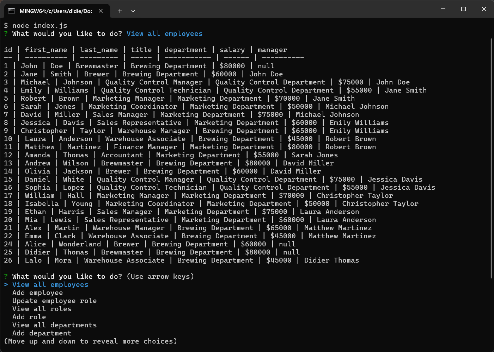

# Employee Management System

Manage your company's employees, roles, and departments with ease using the Employee Management System. This command-line application allows you to view, add, and update employee information, roles, and departments effortlessly.



## Table of Contents

- [Getting Started](#getting-started)
    - [Prerequisites](#prerequisites)
    - [Installation](#installation)
- [Usage](#usage)
    - [Viewing Employees, Roles, and Departments](#viewing-employees-roles-and-departments)
    - [Adding Employees, Roles, and Departments](#adding-employees-roles-and-departments)
    - [Updating Employee Roles](#updating-employee-roles)
- [Features](#features)
- [Features](#features)
- [Walkthrough Video](#walkthrough-video)
- [License](#license)
- [Contact](#contact)

## Getting Started

### Prerequisites

- Node.js (at least version 12)
- MySQL Server
- Inquirer
- DotEnv 

### Installation

1. Clone the repository:

   ```bash
   git clone https://github.com/didierthomasm/Awesome-Employee-Tracker.git

2. Navigate to the project directory:

    ```bash
   cd Awesome-Employee-Tracker

3. Install the dependencies:

    ```bash
   npm install
   
4. Create a `.env` file in the root directory and set your environment variables, for example:

    ```bash
    DB_HOST=localhost
    DB_USER=root
    DB_PASSWORD=your_password
    DB_DATABASE=employee_db


5. Set up your MySQL database and update the config/connection.js file with your database configuration.

6. Run the application:

    ```bash
   node index.js

## Usage

### Viewing Employees, Roles, and Departments

- To view all employees, roles, or departments, select the corresponding option from the main menu.

### Adding Employees, Roles, and Departments

- To add a new employee, role, or department, select the corresponding option from the main menu and follow the prompts.

### Updating Employee Roles

- To update an employee's role, select the "Update Employee Role" option from the main menu and follow the prompts.

## Features

- View, add, and update employees, roles, and departments.
- Interactive prompts using Inquirer.
- Environment variable support with dotenv.
- MySQL database integration for data storage.

## Walkthrough Video

For a detailed walkthrough of how to use the Awesome SVG Logo Maker,
check out our [Walkthrough Video](https://drive.google.com/file/d/1o1zvO34JTeGKIm0PVyVLlOFBojJ1Ib0-/view?usp=sharing).


## Contributing

Contributions are welcome! Fork the repository and submit a pull request.

## License

This project is licensed under the [MIT License](https://opensource.org/licenses/MIT).

[](https://opensource.org/licenses/MIT)

## Contact

If you have any questions, suggestions, or issues, feel free to reach out to me:

- Email: didierthomas.m@gmail.com
- GitHub: [YourGitHubUsername](https://github.com/didierthomasm/)

Feel free to open an issue in the [GitHub repository](https://github.com/didierthomasm/Awesome-Employee-Tracker) 
if you encounter any problems or have suggestions for improvements.